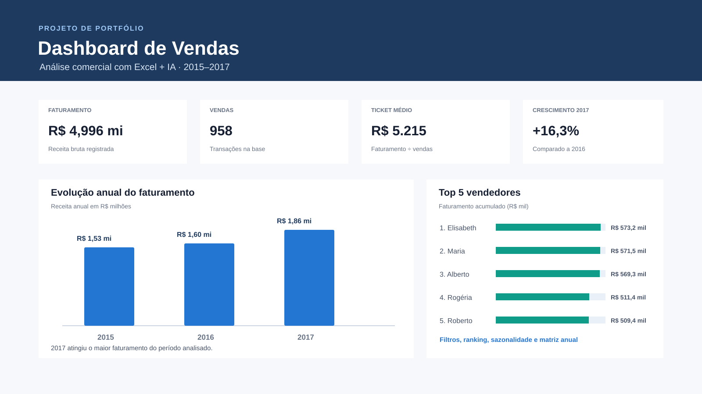

# Dashboard de Vendas



Projeto de análise comercial criado a partir de uma base de 958 vendas, com dados de 2015 a 2017 e cadastro de 10 vendedores. A análise foi estruturada com apoio de IA e entregue em um dashboard HTML autônomo, pronto para publicar no GitHub ou abrir localmente no navegador.

## O que o dashboard responde

- Quanto foi faturado, quantas vendas foram registradas e qual foi o ticket médio.
- Como o faturamento evoluiu a cada ano.
- Quem são os vendedores com maior faturamento no recorte escolhido.
- Quais meses concentram mais e menos receita no histórico completo.
- Como cada vendedor se comporta por ano.
- Qual é a participação de vendas acima de R$ 8 mil e abaixo de R$ 1 mil.

## Principais resultados

- **Faturamento total:** R$ 4.995.675,77.
- **Volume:** 958 vendas.
- **Ticket médio:** R$ 5.214,69.
- **Melhor ano:** 2017, com R$ 1.864.874,44.
- **Crescimento:** 2017 cresceu 16,3% em comparação com 2016.
- **Mês de maior faturamento acumulado:** dezembro, com R$ 499.432,17.
- **Vendedor com maior faturamento acumulado:** Elisabeth, com R$ 573.219,65.

## Como executar

Não é necessário instalar dependências. Abra o arquivo [`index.html`](index.html) em qualquer navegador moderno.

O painel tem filtros por **ano** e **vendedor**. Os indicadores, ranking, evolução anual e matriz são recalculados no navegador conforme o filtro selecionado.

## Estrutura

```text
dashboard-vendas-github/
├── index.html
├── README.md
└── assets/
    └── capa-dashboard-vendas.svg
```

## Tecnologias

- HTML5
- CSS3 responsivo
- JavaScript puro
- SVG nativo para os gráficos, sem bibliotecas externas

## Fonte e limitações

A base possui código da venda, data, valor e vendedor. Por não haver campos de cliente, produto, quantidade, custo, margem ou meta, o projeto não mede rentabilidade, conversão, mix de produtos ou atingimento de metas. Os valores apresentados representam a receita bruta registrada na base.

## Publicar no GitHub

Depois de criar um repositório vazio no GitHub, abra um terminal dentro desta pasta e execute:

```bash
git init
git add .
git commit -m "Adiciona dashboard de vendas"
git branch -M main
git remote add origin URL_DO_SEU_REPOSITORIO
git push -u origin main
```

Para exibir no seu portfólio, use a imagem `assets/capa-dashboard-vendas.svg` como capa do projeto e inclua o link do repositório ou do GitHub Pages.
